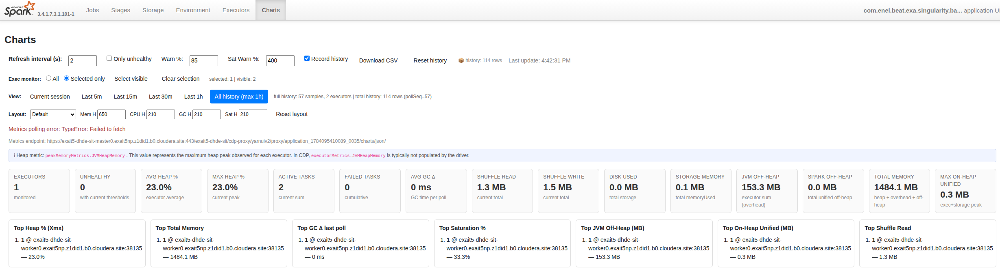
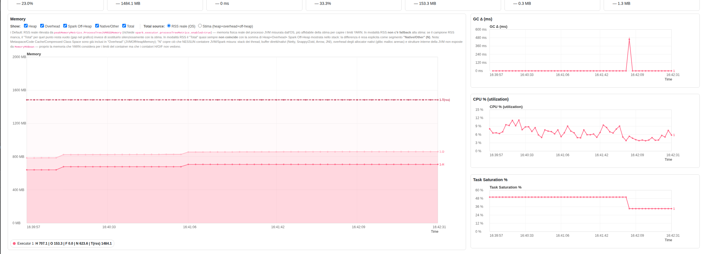
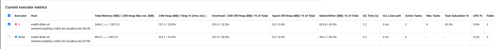

# hpsc-web-ui

Scala module that plugs custom tabs/pages into the driver's Spark UI — the same web server that
serves the built-in Jobs/Stages/Storage/Environment/Executors tabs — without forking Spark or
shipping any extra web assets/JS files. It also ships a ready-made **Charts** tab: a live,
client-side executor heap/CPU/GC/task-saturation dashboard with historical recording and CSV
export.

> **Note:** despite being described elsewhere as "inactive/experimental" and "Java", this module
> is declared in the parent POM (built by a plain `mvn package` from the repo root) and is
> 100% Scala.

## Why

The stock Spark UI shows point-in-time executor metrics (Storage/Executors tabs) but has no
built-in time-series view, no history across restarts of the view, and no CSV export. Rather than
scraping metrics out-of-band (Prometheus/Ganglia sinks, external dashboards, etc.), this module
renders everything client-side, polling a JSON endpoint attached to its own tab and served
directly from data Spark's `AppStatusStore` already collects in-process from executor heartbeats
— the very same data Spark's own REST API (`/api/v1/applications/<appId>/executors`) would
serialize — so it works with **zero extra infrastructure** — just attach the tab from your driver
code and open the Spark UI in a browser.

## Module contents

```
web-ui/
└── src/main/scala/
    ├── org/apache/spark/ui/
    │   ├── HpscUI.scala                  # HpscUITab / HpscUIPage / HpscUI — the private[spark] plumbing
    │   ├── HeapMonitorPage.scala         # ChartsPage — the "Charts" tab (HTML + embedded JS dashboard)
    │   ├── ExecutorCpuTimeListener.scala # SparkListener accumulating real per-executor CPU time
    │   └── ProcessCpuPlugin.scala        # optional SparkPlugin: live OS-level CPU% per executor PID
    └── it/eng/spark/hpsc/webui/
        └── package.scala          # public API: sc.attachUITab / attachUIPage / attachChartsTab
```

### Why two package trees?

`SparkContext#ui`, `SparkUI`, `SparkUITab` and `WebUIPage` are all `private[spark]` in Spark
itself. `HpscUITab`/`HpscUIPage`/`HpscUI` therefore live under `org.apache.spark.ui` so
they can see those types — the same trick used by `org.apache.spark.exa.hpsc.DistributePartitionRDD`
in the `common` module. The public, user-facing API is a completely ordinary `package object` under
`it.eng.spark.hpsc.webui`, following the same implicit-extension convention as every other
connector module in this repo (`hbase`, `phoenix`, `sql`, ...). Application code should only ever
import the latter — never reach into `org.apache.spark.ui` directly.

## Quick start

```scala
import it.eng.spark.hpsc.webui._

// Attach the ready-made dashboard — reachable at http://<driver>:4040/charts/
sc.attachChartsTab()

// ...or under a custom tab name:
sc.attachChartsTab(tabName = "my-metrics")
```

```scala
import it.eng.spark.hpsc.webui._

// Or plug in your own tab/page with arbitrary Scala XML content
sc.attachUITab("hpsc") { request =>
  <div>My custom metrics</div>
}

sc.attachUIPage("hpsc", "details", "HPSC Details") { request =>
  <div>...</div>
}
```

Calling `attachChartsTab`/`attachUITab`/`attachUIPage` more than once with the same `SparkContext`
and `tabName` is a no-op — the existing tab is reused, so it's safe to call from code paths that
may run more than once (e.g. a shared bootstrap helper).

> **Live CPU monitoring is opt-in.** By default, "CPU % (util.)" is only an estimate/near-real-time
> value derived from completed tasks (see [`ExecutorCpuTimeListener`](#real-cpu-time-executorcputimelistener)
> below) and can appear stuck at 0% while long tasks are still running. To get a truly live,
> OS-level CPU% instead, you **must** add this to your Spark configuration (submit flag, or
> `SparkConf`/`spark-defaults.conf`) — attaching the Charts tab alone does **not** enable it:
> ```
> --conf spark.plugins=org.apache.spark.ui.ProcessCpuPlugin
> ```
> See [`ProcessCpuPlugin`](#optional-truly-live-cpu-processcpuplugin) below for details.

## The Charts tab

`sc.attachChartsTab()` adds a **Charts** entry to the Spark UI nav bar. The page itself is fully
self-contained (inline `<style>`/`<script>`, no external files, no CDN dependencies) so it also
works completely offline and behind reverse proxies (YARN ResourceManager UI proxy, Knox, etc.) —
all URLs are built with `UIUtils.prependBaseUri` so they resolve correctly under any `.../proxy/
application_.../` prefix.

### Data source: AppStatusStore, not the public REST API

The client-side dashboard polls a JSON endpoint attached to its own tab —
`.../<tabName>/json` — instead of making an outbound HTTP request to Spark's public
`/api/v1/applications/<appId>/executors` REST endpoint. `ChartsPage.renderJson` reads directly,
server-side, from `sc.statusStore.executorList(false)` (the driver's own `AppStatusStore`,
populated by executor heartbeats) — the exact same in-process data that public REST endpoint
itself would serialize — and returns both active and already-finished executors in one call
(equivalent to what `/allexecutors` used to add as a fallback). Every `WebUIPage` gets this
`.../json` sibling endpoint wired up automatically by Spark's own `WebUI.attachPage`, so no extra
servlet plumbing is needed.

This avoids an extra HTTP round-trip through whatever reverse proxy sits in front of the Spark UI,
which is both faster and more robust than the browser-side `fetch()` this dashboard used
previously — a real proxied deployment observed the client-side REST fetch degrading unreliably
under proxy load, which this same-origin, in-process approach avoids entirely.

### Real CPU time: `ExecutorCpuTimeListener`

Neither `ExecutorSummary` nor `ExecutorStageSummary` (the REST/AppStatusStore DTOs) expose a real
per-executor CPU-time field — Spark's own `ExecutorSource` "cpuTime" dropwizard counter is derived
from the same underlying measurement (`TaskMetrics.executorCpuTime`, itself
`ManagementFactory.getThreadMXBean()`-based) but is only reachable through the separate
`/metrics/json` sink. `ExecutorCpuTimeListener` (a `SparkListener` registered once per
`SparkContext` in `HpscUI.attachCharts`) re-derives the same real value by accumulating
`onTaskEnd` events directly, and `ChartsPage.renderJson` merges it onto each executor's JSON as
`cpuTimeMs` (via `@JsonUnwrapped`, so the REST-API-shaped array of executor objects is preserved).

**Important caveat**: Spark only updates a task's `executorCpuTime` once, when the task *finishes*
— there is no incremental accounting while it's still running. So for executors running few,
long-lived tasks (longer than the dashboard's poll interval), `cpuTimeMs` doesn't change between
polls until a task completes, which can make "CPU % (util.)" appear stuck at 0% for stretches of
time. The dashboard mitigates this: a zero delta is only trusted as "genuinely idle" when the
executor has no active tasks; otherwise it falls back to a `totalDuration`-based wall-clock
estimate (marked `(est.)`) so the value doesn't flatline while tasks are actually busy running. For
a real fix (not just a better estimate), see `ProcessCpuPlugin` below.

### Optional, truly live CPU: `ProcessCpuPlugin`

`ProcessCpuPlugin` is an **opt-in** `SparkPlugin` that reads each executor's OS-level process CPU
usage directly from its own PID (`com.sun.management.OperatingSystemMXBean.getProcessCpuTime()`),
instead of relying on Spark's per-task `executorCpuTime`. Because it reads the whole JVM process
rather than accumulating from completed tasks, it reflects CPU consumed by *currently running*
tasks too — the one thing `ExecutorCpuTimeListener` fundamentally cannot do (see caveat above).

It is disabled by default; Spark plugins are opt-in by design, so nothing runs (no extra thread,
no RPC traffic) unless explicitly enabled. **`sc.attachChartsTab()` alone does not turn this on** —
you must add the following to the Spark configuration used to launch the application (not
something that can be set from inside driver code after the `SparkContext` is created, since
plugins are loaded during context initialization):

```
--conf spark.plugins=org.apache.spark.ui.ProcessCpuPlugin
```

Each executor polls its own process CPU every 2s and reports the delta-based CPU% (normalized by
core count) to the driver over Spark's plugin RPC channel (`PluginContext.send`, fire-and-forget);
the driver polls and records its own CPU the same way, directly. `ChartsPage.renderJson` merges the
latest sample as `osCpuLoadPct`. When present, the dashboard prefers it over `cpuTimeMs`/
`totalDuration` for "CPU % (util.)" (shown with an `(OS)` badge); when the plugin isn't enabled,
the column/chart transparently fall back to the existing `ExecutorCpuTimeListener`-based behavior
described above.

### What it shows


- **Live memory chart** — one series per executor, stacking JVM Heap (`peakMemoryMetrics.
  JVMHeapMemory`, falling back to `memoryMetrics.usedOnHeapStorageMemory`), Overhead (JVM
  off-heap), Spark Off-Heap (unified memory) and, when the real OS-level RSS is available
  (`spark.executor.processTreeMetrics.enabled=true`), an explicit **Native/Other** segment — the
  part of RSS not accounted for by those three counters (thread stacks, native/direct buffers,
  native allocator overhead — NOT Metaspace/Code Cache, which is already inside "Overhead"). Each
  of Heap/Overhead/Spark Off-Heap/Native-Other/Total has its own independent "Show:" checkbox, and
  hovering any chart line shows an exact-value tooltip. Updated every `PollIntervalSeconds`
  (default 5s), keeping a rolling window of `MaxPoints` (default 120) samples per executor.
- **Total Memory** toggle — switch between the real RSS (OS-level, requires
  `spark.executor.processTreeMetrics.enabled=true`) and an estimated sum of Heap+Overhead+Spark
  Off-Heap; RSS is preferred by default, with a visible warning banner when no RSS sample has been
  received yet.
- **Secondary charts**: GC delta, active vs. max tasks (task saturation), CPU utilization %. All
  four charts (Memory, GC, Saturation, CPU) share the same dynamic y-axis scaling — the axis
  always tracks the actual data range with a small (~10-20%) headroom instead of a fixed ceiling,
  so the lines stay readable regardless of the metric's actual magnitude. Default layout keeps the
  Memory chart on the left (full column height) with GC, CPU and Task Saturation stacked in a
  single aligned column on the right; use the **Layout** selector/height inputs to switch to a
  vertical stack or focus any single chart full-width.
- **CPU % (util.)** — real, live OS-level process CPU% (`osCpuLoadPct`, marked `(OS)`) when the
  optional `ProcessCpuPlugin` is enabled (see above); otherwise `ex.cpuTimeMs`, a *real* cumulative
  per-task CPU time (ThreadMXBean-based, aggregated server-side by `ExecutorCpuTimeListener` from
  `onTaskEnd` events), divided by elapsed wall-clock time × core count. Falls back to a
  `totalDuration`-based wall-clock estimate (marked `(est.)`) if `cpuTimeMs` is unavailable, or a
  0 delta can't yet be distinguished from a still-running (not-yet-finished) task.
- **Configurable warning thresholds**: `Warn %` drives the heap-usage warning/"unhealthy" flag
  (default 85%). `Sat Warn %` is a separate threshold for task saturation (`activeTasks/maxTasks`,
  default **400%**) — kept independent because, unlike heap, task saturation legitimately and
  routinely exceeds 100% when many small tasks oversubscribe an executor's cores, so a threshold
  near 100% would flag perfectly normal executors as unhealthy.
- **Executor table** with client-side sorting, per-column change indicators, an "only unhealthy"
  filter, and per-executor checkboxes to isolate a subset of executors on the charts/legend. The
  JVM Heap and Heap % columns are merged into a single "JVM Heap (MB) / Heap %" column.
- **Top offenders** summary cards (highest heap usage, most GC time, most failed tasks, ...).
- **History recording**: every poll is optionally appended, in memory, to a `historyRows` buffer
  — bounded to the **last 1 hour** (`HISTORY_MAX_AGE_MS`), with a 20 000-row hard cap as a secondary
  safety net — and also persisted to `localStorage` (best-effort, capped at 500 rows) so it survives
  a page reload. Switch the view selector to "Last 5m"/"Last 15m"/... /"All history (max 1h)" to
  render the charts/table from that recorded history instead of only the live rolling window.
- **CSV export** — `Download CSV` serializes the full in-memory `historyRows` buffer (not just the
  currently-filtered view) to `heap-history-<applicationId>.csv`.
- **Reset history** — clears both the in-memory buffer and the persisted `localStorage` entry.

### How history persistence works (and its limits)

- The **live "Current session" view** and the **recorded history view** are two independent,
  in-memory data structures. The former (`labels`/`executors`) is populated directly by `poll()`
  and never touches `localStorage`; it always works, everywhere.
- The history buffer (`historyRows`) is *also* best-effort persisted to `localStorage`
  (key `hpsc.heap.history.<applicationId>`) purely so it survives a page reload. **A failure to
  persist never truncates or otherwise mutates the in-memory buffer** — it only disables further
  persistence attempts for the rest of that browser tab's lifetime (indicated by a `⚠️ no storage`
  badge next to the row count). In other words: recording, charting, filtering, sorting and CSV
  export always work against the in-memory buffer regardless of whether `localStorage` is
  available.
- On load, stale `hpsc.heap.history.*` entries left behind by *other* (typically already-finished)
  applications are automatically purged, keeping only the current application's own entry. Without
  this, a long-lived, shared browser session (e.g. reused for weeks across many applications
  through the same proxy URL) would eventually exhaust the whole origin's storage quota, causing
  even the very first, tiny write of a brand-new application to fail with a genuine
  `QuotaExceededError`.
- Behind a reverse proxy that blocks or partitions `localStorage` entirely, persistence may never
  succeed at all for that session — history still works correctly for as long as the tab stays
  open, it just won't survive a reload. This is an inherent limitation of the browser/proxy
  environment, not something further fixable client-side without a server-side persistence
  mechanism.
- **In-memory history is capped to the last 1 hour** (`HISTORY_MAX_AGE_MS = 60 * 60 * 1000`),
  trimmed every time a new snapshot is recorded (and applied again to whatever was restored from
  `localStorage` on page load). On long-running applications with many executors, an unbounded
  history buffer keeps growing for as long as the tab stays open and eventually makes the browser
  tab sluggish or unresponsive; the 1h cap keeps memory usage predictable regardless of how long
  the application (and the open tab) has been running. Older samples are simply discarded — export
  to CSV periodically if you need to keep a longer record.
- **Important**: the dashboard's HTML/JS is generated server-side, embedded in this module's JAR,
  and rendered fresh per HTTP request by the *running* driver process. Deploying a new build of
  this module has no effect on an application that is already running — the application (and thus
  its driver's embedded Jetty server) must be restarted with the updated JAR for changes to take
  effect.

### Screenshots

Captured from a real YARN-clustered deployment (behind the YARN ResourceManager UI proxy),
showing the merged Total Memory/Heap Max and Overhead/Off-Heap/Native-Other columns with their
breakdown percentages, the RSS vs. estimated Total Memory toggle, and the CPU % chart driven by
real (non-zero, non-flat) values instead of getting stuck at 0%. The transient red "Metrics
polling error" banner in the first screenshot is the dashboard's own client-side fetch-failure
handling surfacing a one-off network hiccup against the proxied metrics endpoint — it clears again
on the next successful poll.

**Full "Charts" tab** — refresh/filter controls, history/CSV controls, summary cards, top-offender
rankings and the memory chart:



**Time-series charts** — memory (heap/overhead/off-heap/total, RSS-sourced here), GC Δ, CPU %, and
task saturation, one series per selected executor:



**Executor metrics table** — sortable, per-column change highlighting, selection checkboxes to
isolate executors on the charts above, with the merged Total Memory/Heap Max column and
Overhead/Spark Off-Heap/Native-Other columns each showing their % of Total Memory:



## Public API reference

All of the following are implicit extensions on `SparkContext`, added by
`import it.eng.spark.hpsc.webui._`:

| Method | Description |
|---|---|
| `sc.attachChartsTab(tabName: String = "charts")` | Attaches the ready-made Charts dashboard. |
| `sc.attachUITab(tabName, title = null)(content: HttpServletRequest => Seq[Node])` | Registers a new tab whose landing page renders `content`. |
| `sc.attachUIPage(tabName, pagePrefix, title = null)(content: HttpServletRequest => Seq[Node])` | Adds an extra page under an existing (or not-yet-created) tab, reachable at `.../<tabName>/<pagePrefix>/`. |

`ChartsPage.PollIntervalSeconds` (default `5`) and `ChartsPage.MaxPoints` (default `120`) are
compile-time constants in `org.apache.spark.ui.ChartsPage`; there is currently no runtime
configuration surface (e.g. Spark conf keys) for them.

## Building & testing

This module is built as part of the normal reactor build:

```bash
mvn clean package -DskipTests            # from the repo root
mvn -pl web-ui -am package -DskipTests    # this module (and its dependencies) only
```

### Running tests

The inherited parent POM sets `skipTests=true` by default, so a plain `mvn test`/`mvn package`
silently builds **without running any tests**. You must pass `-DskipTests=false` explicitly:

```bash
mvn -pl web-ui -am test -DskipTests=false
```

Tests run via `scalatest-maven-plugin` (goal `test`), not surefire (surefire's `default-test`
execution always reports "Tests run: 0" here, since these are ScalaTest classes, not
JUnit-annotated). To run a single suite, use `-Dsuites=<FQCN>` (not `-Dtest=`):

```bash
mvn -pl web-ui -am test -DskipTests=false -Dsuites=org.apache.spark.ui.ChartsPageContentTest
```

### Test suite overview

Tests live under `web-ui/src/test/scala/org/apache/spark/ui/` (in the same
`org.apache.spark.*` package tree as `HpscUI`, since assertions on `sc.ui.get.getTabs`/`.pages` etc.
require visibility into Spark's own `private[spark]` types):

- **`support/SparkUiTestSupport`** — shared trait providing `withLocalSparkContext`/
  `withUiDisabledSparkContext` (a real local `SparkContext`, started/stopped per test) and
  `fakeRequest()` (a JDK dynamic-proxy `HttpServletRequest` stub — no Mockito is available in this
  repo's test scope, and hand-implementing dozens of interface methods isn't worth it when only
  `getHeader` is ever actually called by `UIUtils`).
- **`HpscUITest`** — tab/page attachment, idempotency (calling `attachCharts`/`attachPage` twice is
  a no-op), the `IllegalStateException` thrown when the Spark UI is disabled, and isolation across
  independent `SparkContext`s.
- **`WebUIPackageExtensionsTest`** — the public `it.eng.spark.hpsc.webui._` implicit
  extensions (`attachUITab`, `attachUIPage`, `attachChartsTab`).
- **`ChartsPageContentTest`** — content/regression tests for the embedded JS dashboard, plus a
  direct test of `ChartsPage.renderJson`. Since no JS engine is available in this repo (Nashorn was
  removed in JDK 17, and adding one would be scope creep just for tests), the embedded `<script>`
  is validated via targeted string/regex extraction, e.g.:
  - no duplicate keys in the `historyRows.push({...})` object literal;
  - every CSV export header has a corresponding recorded field (guards against the historical bug
    where several fields were referenced by the CSV/history view but never actually populated);
  - `saveHistory()` never reassigns/splices the in-memory `historyRows` buffer — persistence
    failures may only disable further persistence attempts (`localStorageAvailable = false`);
  - the in-memory history buffer is bounded solely by `HISTORY_MAX_ROWS`, independent of
    `localStorage` outcomes;
  - `loadHistory()` purges stale history entries left by other applications before touching its
    own key, and never removes its own entry;
  - the dashboard fetches from its own same-origin `.../json` endpoint and never references the
    public REST API paths (`/api/v1/applications/`, `/allexecutors`);
  - `renderJson` itself is exercised directly (not just via regex on the script) and asserted to
    return a well-formed JSON array of executor summaries.

Booting a real local `SparkContext` for these tests requires `guava` on the test classpath —
added as a test-scope, versionless dependency in `pom.xml` (relying on the parent POM's
`dependencyManagement`), since it doesn't come transitively through `spark-core` in this repo's
dependency setup (the "exa" parent marks many transitives as `provided`, since final runtime
classpath assembly happens in the `deploy` module).

`jackson-databind` and `jackson-module-scala_${scala.binary.version}` are declared as `provided`
(compile+test, not bundled — same reasoning as `spark-core` itself): `ChartsPage.renderJson`
builds an `ObjectMapper` configured with `DefaultScalaModule` (to correctly serialize the
`Option`/`Seq`/`Map`-based `ExecutorSummary` case class fields) to serve executor metrics read
directly from `AppStatusStore`. Both libraries are already transitively available at Spark
runtime (Spark's own REST API uses the same libraries internally), so nothing extra needs to be
shipped — they're declared explicitly here only so the module compiles on its own without relying
on an undeclared transitive dependency.

## Known limitations

- No server-side persistence: all history lives in the browser (memory + best-effort
  `localStorage`); closing the tab or clearing site data loses anything not exported to CSV first.
- `ChartsPage.PollIntervalSeconds`/`MaxPoints` are compile-time constants, not exposed as Spark
  configuration properties.
- The embedded JS has no automated browser-level test coverage (no headless browser in this repo's
  test scope) — `ChartsPageContentTest` validates it via static string/regex analysis instead of
  execution.
